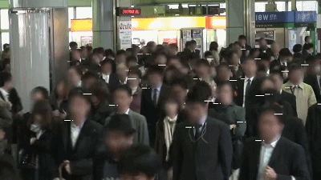
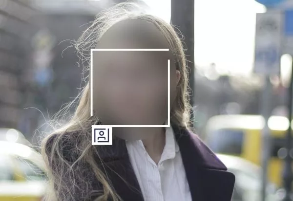

# 使用人脸关键点算法实现Android手机端人脸匿名功能


## 什么是人脸匿名（Face Anonymization）

随着人脸识别技术的普及，人脸数据的隐私问题也得到越来越多关注，针对隐私保护的研究也陆续出现。目前大致有下面几个方向

1. 篡改输入人脸识别系统的图像。
2. 生成式对抗网络(GAN)来匿名某人的照片或视频。
3. 直接模糊人脸识别到的人脸


本文主要讲第3点，讲讲怎么使用移动端人脸关键点算法实现人脸匿名功能。这种方法对设备要求低，代码简单易懂，修改后就可直接落地。


下图就是最终想实现的功能
<br>


## 什么是人脸关键点算法（Face Landmarks）

人脸关键点检测是人脸相关算法中的关键一环，它是人脸识别、表情分析、3D人脸重建，表情驱动3D动画等一系列人脸相关问题的前提。


我们将使用TengineKit来实现人脸匿名功能

### TengineKit
免费移动端实时人脸212关键点SDK。是一个易于集成的人脸检测和人脸关键点SDK。它可以在各种手机上以非常低的延迟运行。
<br>
https://github.com/OAID/TengineKit


### TengineKit 效果图


## 实现

### 配置 Gradle

Project中的build.gradle添加

```java
    repositories {
        ...
        mavenCentral()
        ...
    }

    allprojects {
        repositories {
            ...
            mavenCentral()
            ...
        }
    }
```

主Module中的build.gradle添加

```java
    dependencies {
        ...
        implementation 'com.tengine.android:tenginekit:1.0.3'
        ...
    }
```


### 配置 manifests

```xml
    <uses-permission android:name="android.permission.ACCESS_NETWORK_STATE" />
    <uses-permission android:name="android.permission.INTERNET"/>

    <uses-permission android:name="android.permission.READ_EXTERNAL_STORAGE"/>
    <uses-permission android:name="android.permission.WRITE_EXTERNAL_STORAGE"/>
    <uses-permission android:name="android.permission.READ_PHONE_STATE"/>

    <uses-permission android:name="android.permission.CAMERA"/>
    <uses-permission android:name="android.permission.FLASHLIGHT" />

    <uses-feature android:name = "android.hardware.camera" android:required="true"/>
    <uses-feature android:name = "android.hardware.camera.autofocus" />
```

### 初始化Android Camera
为App创建自定义摄像头界面的步骤如下：
1. 检测和访问Camera
2. 创建预览TextureView
3. 构建预览TextureView布局
4. 将Camera和TextureView绑定
5. 启动预览

我们先new一个TextureView.SurfaceTextureListener，在里面完成camera的初始配置，当TextureView可用的时候，onSurfaceTextureAvailable中的代码将被调用
```java
   private final TextureView.SurfaceTextureListener surfaceTextureListener = new TextureView.SurfaceTextureListener() {
        @Override
        public void onSurfaceTextureAvailable(final SurfaceTexture texture, final int width, final int height) {
            int index = getCameraId();
            camera = Camera.open(index);

            try {
                Camera.Parameters parameters = camera.getParameters();
                List<String> focusModes = parameters.getSupportedFocusModes();
                if (focusModes != null && focusModes.contains(Camera.Parameters.FOCUS_MODE_CONTINUOUS_PICTURE)) {
                    parameters.setFocusMode(Camera.Parameters.FOCUS_MODE_CONTINUOUS_PICTURE);
                }
                List<Camera.Size> cameraSizes = parameters.getSupportedPreviewSizes();
                Size[] sizes = new Size[cameraSizes.size()];
                int i = 0;
                for (Camera.Size size : cameraSizes) {
                    sizes[i++] = new Size(size.width, size.height);
                }
                Size previewSize = CameraConnectionFragment.chooseOptimalSize(sizes, desiredSize.getWidth(), desiredSize.getHeight());
                parameters.setPreviewSize(previewSize.getWidth(), previewSize.getHeight());
                camera.setDisplayOrientation(90);
                camera.setParameters(parameters);
                camera.setPreviewTexture(texture);
            } catch (IOException exception) {
                camera.release();
            }

            camera.setPreviewCallbackWithBuffer(imageListener);
            Camera.Size s = camera.getParameters().getPreviewSize();
            camera.addCallbackBuffer(new byte[ImageUtils.getYUVByteSize(s.height, s.width)]);

            textureView.setAspectRatio(s.height, s.width);
            camera.startPreview();
        }

        @Override
        public void onSurfaceTextureSizeChanged(final SurfaceTexture texture, final int width, final int height) {
        }

        @Override
        public boolean onSurfaceTextureDestroyed(final SurfaceTexture texture) {
            return true;
        }

        @Override
        public void onSurfaceTextureUpdated(final SurfaceTexture texture) {
        }
    };
```

此处将textureView和camera联系起来
```java
    textureView.setSurfaceTextureListener(surfaceTextureListener);
```

当camera启动预览，textureView得到真实的size后。我们得到了camera的输出视频流的宽高和预览textureView，将其保存起来，后续有用到。
```java
    textureView.setRealSizeListener(new AutoFitTextureView.RealSizeListener() {
        @Override
        public void onRealSizeMeasure(int w, int h) {
            if(!isReady){
                isReady = true;
                Camera.Size s = camera.getParameters().getPreviewSize();
                cameraReadyListener.onCameraReady(
                        s.width, s.height,w, h
                );
            }
        }
    });
```

### 处理Camera传过来的视频流

首先我们先初始化TengineKit:
1. 选用camera处理模式
2. 打开人脸检测和人脸关键点功能
3. 设置视频流格式为YUV_NV21（Android camera默认格式）
4. 设置输入视频流的宽高，此处为camera的预览宽高
5. 设置输出视频流的宽高，此处为textrureView的宽高
6. 设置输入视频流来自前置摄像头
```java
    com.tenginekit.Face.init(getBaseContext(),
            AndroidConfig.create()
                    .setCameraMode()
                    .openFunc(AndroidConfig.Func.Detect)
                    .openFunc(AndroidConfig.Func.Landmark)
                    .setInputImageFormat(AndroidConfig.ImageFormat.YUV_NV21)
                    .setInputImageSize(previewWidth, previewHeight)
                    .setOutputImageSize(outputWidth, outputHeight)
    );
    com.tenginekit.Face.Camera.switchCamera(false);
```
处理数据
1. 得到手机旋转角度，将其设置到TengineKit
2. 开始检测，当检测到人脸数目大于0的时候，调用faceDetect.landmark2d()，得到人脸关键点链表
```java
    int degree = CameraEngine.getInstance().getCameraOrientation(sensorEventUtil.orientation);

    com.tenginekit.Face.Camera.setRotation(degree - 90, false,
            outputWidth, outputHeight);

    com.tenginekit.Face.FaceDetect faceDetect = Face.detect(data);
    faceLandmarks = null;
    if(faceDetect.getFaceCount() > 0){
        faceLandmarks = faceDetect.landmark2d();
    }
```

### 高斯模糊和绘制
这里使用Android的bitmap来实现功能，这种做法比较粗糙，性能差，但是简单易懂，如果读者有兴趣可以使用OpenGLES来实现此功能。
1. 将从摄像头中得到的yuv数据通过TengineKit的图片帮助函数转化为Bitmap
2. 通过人脸关键点的外接框，裁剪bitmap得到人脸的bitmap数组
3. 将得到的人脸bitmap进行高斯模糊
```java
    if(testBitmap != null){
        testBitmap.recycle();
    }
    testBitmap = Face.Image.convertCameraYUVData(
            data,
            previewWidth, previewHeight,
            outputWidth, outputHeight,
            - 90,
            true);


    for(Bitmap bitmap : testFaceBitmaps){
        bitmap.recycle();
    }
    testFaceBitmaps.clear();
    if(testBitmap != null && faceDetect.getFaceCount() > 0){
        if(faceLandmarks != null){
            for (int i = 0; i < faceLandmarks.size(); i++) {
                    Bitmap face = BitmapUtils.getDstArea(testBitmap, faceLandmarks.get(i).getBoundingBox());
                    face = BitmapUtils.blurByGauss(face, 50);
                    testFaceBitmaps.add(face);
            }
        }
    }

    runInBackground(new Runnable() {
        @Override
        public void run() {
            trackingOverlay.postInvalidate();
        }
    });
```

trackingOverlay为定制的view，将canvas暴露出来用于画bitmap

```java
    trackingOverlay.addCallback(new OverlayView.DrawCallback() {
        @Override
        public void drawCallback(final Canvas canvas) {
            if(testBitmap != null){
                canvas.drawBitmap(testBitmap, 0,0, circlePaint);
            }
            if(faceLandmarks != null){
                for (int i = 0; i < faceLandmarks.size(); i++) {
                    Rect r = faceLandmarks.get(i).getBoundingBox();
                    canvas.drawRect(r, circlePaint);
                    canvas.drawBitmap(testFaceBitmaps.get(i), r.left, r.top, circlePaint);
                }
            }
        }
    });
```

### 效果

原图|结果
:--:|:--:
 | 

### Demo


### 参考

1. [TengineKit is an easy-to-integrate face detection and face landmarks SDK. ](https://github.com/OAID/TengineKit)
2. [brighter.ai](https://brighter.ai/)


